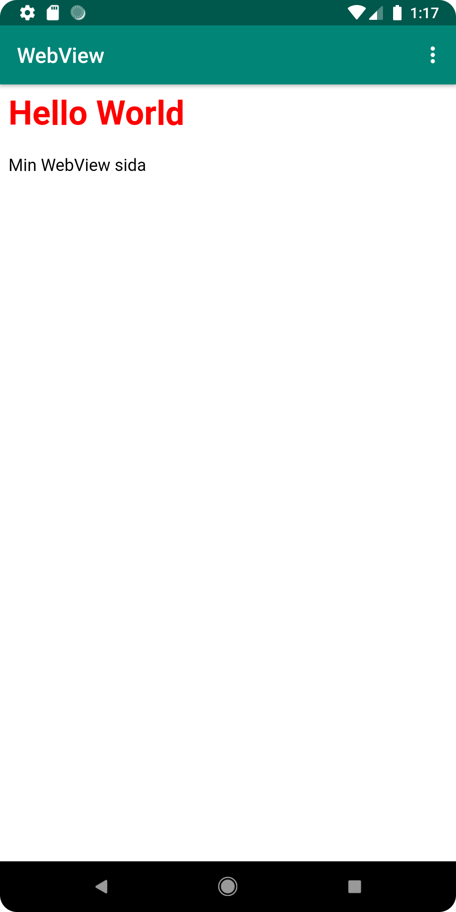

Ändrade namn på appen till WebView i mappen /app/src/main/res/values/
```
<string name="app_name">WebView</string>
```
La till internet åtkomst för appen genom en kod rad i mappen /app/src/main/AndroidManifest.xml
```
<uses-permission android:name="android.permission.INTERNET" />
```
I mappen /app/src/main/res/layout/activity_main.xml skapades ett webview element och fick id = my_webview
```
<WebView
android:id="@+id/my_webview"
android:layout_width="0dp"
android:layout_height="0dp"
```
Skapade en privat member variabel med namnet myWebView och kopplade ihop den med webview elementet. 
Var tvungen att lägga till en import för att kunna använda Webview typen för member variabeln.
```
import android.webkit.WebView;
private WebView myWebView;
myWebView = findViewById(R.id.my_webview);
```
La till en WebViewClient som kopplades ihop med variabeln myWebView och likadant med webview behövde en import göras för att kunna använda WebViewClient.
```
import android.webkit.WebViewClient;
myWebView.setWebViewClient(new WebViewClient());
```
Satte igång så javascript går att utföra på appen
```
myWebView.getSettings().setJavaScriptEnabled(true);
```
Skapade en simpel HTML sida med en rubrik och en paragraf med lite styling som en asset i appen. Ligger i mappen /app/src/main/assets/webpage.html
````
<html>
<head>
    <style>
        h1{
            color:red;
        }
    </style>
</head>
<body>
    <h1>Hello World</h1>
    <p>Min WebView sida</p>
</body>
</html>
````
I mappen /app/src/main/java/com/example/webviewapp/MainActivity.java lades först kod in i if-satsen external_web för att kunna kalla på funktionen showExternalWebPage.
I funktionen tillsätts det att webview elementet ska visa sidan his.se.
```
public void showExternalWebPage(){
    myWebView.loadUrl("https://www.his.se/");
}
if (id == R.id.action_external_web) {
    Log.d("==>","Will display external web page");
    showExternalWebPage();
    return true;
}
```
Liknande med external så kallas funktionen showInternalWebPage genom if satsen för internal_web.
Funktionen gör så att webview elementet visar den interna hemsidan som skapades tidigare i uppgiften
```
public void showInternalWebPage(){
    myWebView.loadUrl("file:///android_asset/webpage.html");
}
if (id == R.id.action_internal_web) {
    Log.d("==>","Will display internal web page");
    showInternalWebPage();
    return true;
}
```



